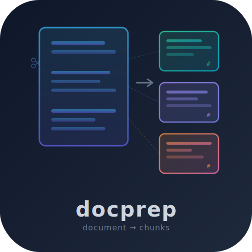
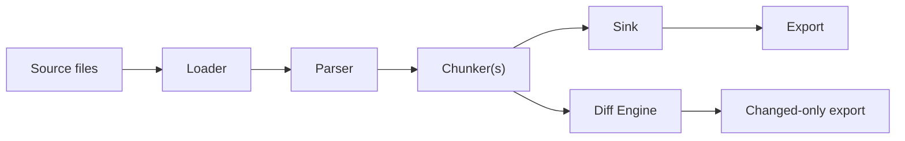

<p align="center">
  
</p>

# docprep

Deterministic chunk IDs and incremental sync for document ingestion.

[](https://github.com/yeongseon/docprep/actions/workflows/ci-test.yml)
[](https://pypi.org/project/docprep/)
[](https://www.python.org/downloads/)
[](https://opensource.org/licenses/MIT)

## What is docprep?

docprep is a document ingestion layer for RAG pipelines. It transforms source documents into structured chunks with **deterministic IDs**, **Markdown-aware boundaries**, and **incremental sync**. It sits between your documents and your vector store:



docprep produces the same chunk IDs for the same input, every time. When documents change, it computes a structural diff and exports only the added, modified, or deleted chunks — so you re-embed only what changed.

## What docprep is NOT

- **Not a document parser.** Use [MarkItDown](https://github.com/microsoft/markitdown), [Docling](https://github.com/DS4SD/docling), or [Unstructured](https://github.com/Unstructured-IO/unstructured) for PDFs/DOCX/PPTX, then feed Markdown into docprep via [adapters](docs/adapters.md).
- **Not an embedding service.** docprep produces text chunks; you bring your own embedding model.
- **Not a vector database.** docprep exports chunk records as JSONL ([VectorRecordV1](docs/export.md)); you load them into Qdrant, pgvector, Chroma, or any other store.
- **Not a RAG framework.** Use LlamaIndex or LangChain for retrieval. docprep handles the ingestion layer.

## How docprep compares

| Feature | docprep | MarkItDown | Docling | Unstructured | Chonkie |
|---------|---------|------------|---------|--------------|---------|
| Deterministic chunk IDs | ✅ | N/A | ❌ | ❌ | ❌ |
| Markdown-aware splitting | ✅ | N/A | Limited | Limited | ❌ |
| Incremental sync (diff) | ✅ | ❌ | ❌ | ❌ | ❌ |
| Multi-format parsing | Via [adapters](docs/adapters.md) | ✅ | ✅ | ✅ | ❌ |
| Plugin system | ✅ | ❌ | ❌ | ❌ | ❌ |
| Chunk-level provenance | ✅ | N/A | Partial | Partial | ❌ |

## What ships today

| Category | Built-in | Via third-party adapter/plugin |
|----------|----------|-------------------------------|
| **Loaders** | Markdown, FileSystem | — |
| **Parsers** | Markdown, Plaintext, HTML, RST, Auto | — |
| **Chunkers** | Heading, Size, Token | — |
| **Sinks** | SQLAlchemy (SQLite, PostgreSQL) | — |
| **Adapters** | — (third-party by design) | MarkItDown, Docling, etc. |
| **Export** | JSONL (VectorRecordV1) | — |

> **Default behavior**: `ingest("docs/")` uses the FileSystem loader, which picks up `.md`, `.txt`, `.html`, `.htm`, and `.rst` files. For Markdown-only ingestion, set `loader.type = "markdown"` in `docprep.toml`.

## What Goes Into Your Vector DB

Each chunk becomes a `VectorRecordV1` record with full provenance — here's what one looks like:

```json
{
  "id": "7a3f2b91-c8e4-5d16-a0b3-9e8f7c6d5a42",
  "document_id": "e1d2c3b4-a5f6-5789-b012-3c4d5e6f7a8b",
  "section_id": "f9e8d7c6-b5a4-5321-9876-5f4e3d2c1b0a",
  "chunk_anchor": "installation:3f8a1b2c",
  "section_anchor": "installation",
  "text": "Getting Started\n\nInstallation\n\nInstall docprep via pip:\n\npip install docprep\n\nRequires Python 3.10 or later.",
  "content_hash": "a1b2c3d4e5f6",
  "char_count": 112,
  "source_uri": "file:docs/getting-started.md",
  "title": "Getting Started",
  "section_path": ["Getting Started", "Installation"],
  "schema_version": 1,
  "pipeline_version": "0.1.1",
  "created_at": "2025-04-12T10:30:00Z",
  "user_metadata": {
    "author": "docprep team",
    "category": "setup"
  }
}
```

See the [Export Guide](docs/export.md) for the full schema reference, text prepend strategies, and changed-only export.

## Installation

```bash
pip install docprep
```

For PostgreSQL support:

```bash
pip install docprep[postgres]
```

## Quick Start

### Config-first (recommended)

Create a `docprep.toml` in your project root:

```toml
source = "docs/"

[sink]
database_url = "sqlite:///docs.db"
create_tables = true

[[chunkers]]
type = "heading"

[[chunkers]]
type = "size"
max_chars = 1500
```

For token-aware splitting (recommended when targeting specific embedding models), use `type = "token"` with `max_tokens = 512`.

Then run:

```bash
docprep ingest              # Ingest documents
docprep preview             # Preview structure without persisting
docprep export -o out.jsonl # Export as JSONL
docprep diff                # Show what changed since last ingest
```

### Python API

```python
from docprep import ingest

result = ingest("docs/")
for doc in result.documents:
    print(f"{doc.title}: {len(doc.sections)} sections, {len(doc.chunks)} chunks")
```

### With database persistence

```python
from sqlalchemy import create_engine
from docprep import ingest
from docprep.sinks.sqlalchemy import SQLAlchemySink

engine = create_engine("sqlite:///docs.db")
sink = SQLAlchemySink(engine=engine)

result = ingest("docs/", sink=sink)
print(f"Persisted: {result.persisted}, Skipped: {len(result.skipped_source_uris)}")
```

### Changed-only export

```bash
docprep export docs/ --changed-only --db sqlite:///docs.db -o delta.jsonl
```

## Documentation

| Guide | Description |
|-------|-------------|
| [Getting Started](docs/getting-started.md) | Installation, first ingestion, basic usage |
| [Configuration](docs/configuration.md) | `docprep.toml` reference and all options |
| [CLI Reference](docs/cli-reference.md) | All commands, flags, and examples |
| [Python API](docs/python-api.md) | Types, functions, and usage patterns |
| [Architecture](docs/architecture.md) | Pipeline flow, identity model, module map |
| [Export](docs/export.md) | VectorRecordV1, JSONL, changed-only export |
| [Plugins](docs/plugins.md) | Entry-point plugin system |
| [Adapters](docs/adapters.md) | External converter integration |
| [Lifecycle](docs/lifecycle.md) | Deletion, sync, prune, and change detection |
| [Performance](docs/performance.md) | Benchmark results, cost savings, concurrency |
| [Roadmap](ROADMAP.md) | Project status, planned features, Beta criteria |

Design decisions are documented as [Architecture Decision Records](docs/decisions/README.md).

## Supported Parsers

| Format | Extensions | Parser | Notes |
|--------|-----------|--------|-------|
| Markdown | `.md` | Built-in | Frontmatter extraction, heading hierarchy |
| Plain text | `.txt` | Built-in | First non-empty line as title |
| HTML | `.html`, `.htm` | Built-in (stdlib) | Strips script/style, converts headings |
| reStructuredText | `.rst` | Built-in | Heading adornments, field lists |
| Any format | `*` | Via [adapter](docs/adapters.md) | Third-party adapters (MarkItDown, Docling, Unstructured) convert to Markdown first |

## Development

```bash
git clone https://github.com/yeongseon/docprep.git
cd docprep
make install

make check-all    # lint + typecheck + test + security
make test         # pytest
make lint         # ruff + mypy
make format       # ruff format
```

See [CONTRIBUTING.md](CONTRIBUTING.md) for the full development guide.

## License

MIT
