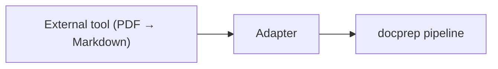

# Adapters

Adapters bridge external document processing tools (MarkItDown, Docling, Unstructured, etc.) with docprep. They convert non-Markdown formats into docprep `Document` objects so the standard chunking and export pipeline can process them.

## When to Use Adapters

docprep's built-in parsers handle Markdown, plain text, HTML, and reStructuredText. For everything else — PDFs, DOCX, PPTX, spreadsheets — use an adapter:



This follows the **adapter-not-parser** design principle: docprep focuses on structural chunking, not format conversion. See [ADR-0002](decisions/0002-adapter-not-parser.md).

## Adapter Protocol

An adapter implements two members:

```python
from collections.abc import Iterable
from pathlib import Path
from docprep.models.domain import Document

class Adapter:
    def convert(self, source: str | Path) -> Iterable[Document]:
        """Convert source file(s) to docprep Documents."""
        ...

    @property
    def supported_extensions(self) -> frozenset[str]:
        """File extensions this adapter handles (e.g. {".pdf", ".docx"})."""
        ...
```

The protocol is defined at `docprep.adapters.protocol.Adapter` and is decorated with `@runtime_checkable`, so you can verify conformance:

```python
from docprep import Adapter

assert isinstance(my_adapter, Adapter)
```

## Writing an Adapter

### Example: MarkItDown Adapter

```python
from collections.abc import Iterable
from pathlib import Path
from markitdown import MarkItDown

from docprep import Adapter, ingest
from docprep.ids import document_id, sha256_checksum
from docprep.models.domain import Document


class MarkItDownAdapter:
    """Adapter that converts any MarkItDown-supported format to docprep Documents."""

    def __init__(self) -> None:
        self._converter = MarkItDown()

    def convert(self, source: str | Path) -> Iterable[Document]:
        path = Path(source)
        if path.is_file():
            yield self._convert_file(path)
        elif path.is_dir():
            for file_path in sorted(path.rglob("*")):
                if file_path.suffix.lower() in self.supported_extensions:
                    yield self._convert_file(file_path)

    def _convert_file(self, path: Path) -> Document:
        result = self._converter.convert(str(path))
        markdown = result.text_content
        source_uri = f"file:{path.as_posix()}"
        return Document(
            id=document_id(source_uri),
            source_uri=source_uri,
            title=result.title or path.stem,
            source_checksum=sha256_checksum(markdown),
            source_type="markdown",
            body_markdown=markdown,
        )

    @property
    def supported_extensions(self) -> frozenset[str]:
        return frozenset({".pdf", ".docx", ".pptx", ".xlsx", ".html", ".csv"})
```

### Using an Adapter Directly

Pass adapter output to `ingest()` by first converting, then processing:

```python
adapter = MarkItDownAdapter()
documents = list(adapter.convert("reports/"))

# Now chunk the converted documents
from docprep import Ingestor

ingestor = Ingestor()
# Each document is already parsed; you'd typically feed them through
# the chunking pipeline separately
```

A more common pattern is to use the adapter within a custom loader that feeds into the standard pipeline.

## Registering an Adapter as a Plugin

Register your adapter via entry points in `pyproject.toml`:

```toml
[project.entry-points."docprep.adapters"]
markitdown = "my_package.adapters:MarkItDownAdapter"
```

After installation, docprep discovers the adapter automatically.

## Built-in Adapters

docprep does not ship with any built-in adapters — this is by design. The adapter entry-point group (`docprep.adapters`) is reserved for third-party packages.

Recommended external tools for document conversion:

| Tool | Formats | Notes |
|------|---------|-------|
| [MarkItDown](https://github.com/microsoft/markitdown) | PDF, DOCX, PPTX, XLSX, HTML, CSV | Microsoft's converter |
| [Docling](https://github.com/DS4SD/docling) | PDF, DOCX, PPTX, HTML | IBM's document understanding |
| [Unstructured](https://github.com/Unstructured-IO/unstructured) | 30+ formats | General-purpose ETL |

## Design Rationale

The adapter pattern keeps docprep focused:

1. **Separation of concerns** — Format conversion is a solved problem; docprep doesn't reinvent it.
2. **Composability** — Use whichever external tool fits your formats, then feed Markdown into docprep.
3. **Stability** — docprep's core identity model and chunking logic don't change when new formats emerge.
4. **Testing** — Adapters can be tested independently from the chunking pipeline.

See [ADR-0002: Adapter-Not-Parser](decisions/0002-adapter-not-parser.md) for the full decision record.
