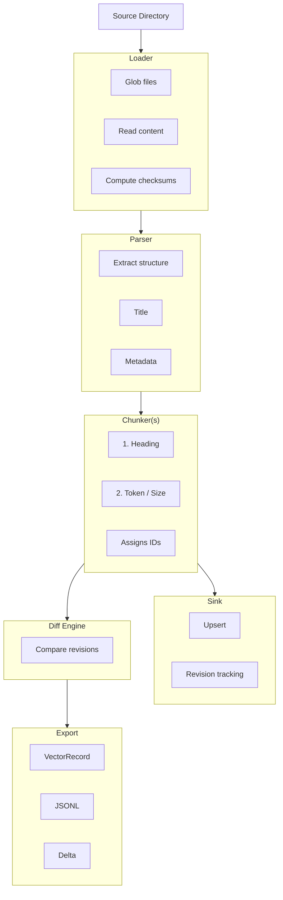

# Architecture

This document describes docprep's internal architecture, pipeline flow, identity model, and key design decisions.

## Pipeline Overview



## Module Map

```
src/docprep/
├── __init__.py              # Public API surface, version, lazy exports
├── ingest.py                # Ingestor class — pipeline orchestration
├── config.py                # TOML config loading, discovery, validation
├── registry.py              # Component resolution (built-in + plugins)
├── plugins.py               # Entry-point plugin discovery
├── ids.py                   # Deterministic ID generation (UUIDv5)
├── diff.py                  # Structural diff engine
├── export.py                # VectorRecord/V1 export, JSONL, ExportDelta
├── checkpoint.py            # Resumable ingestion checkpoints
├── metadata.py              # Metadata normalization
├── exceptions.py            # Exception hierarchy
├── progress.py              # Progress event types and callbacks
├── scope.py                 # Source scope derivation
│
├── models/
│   └── domain.py            # All domain types (Document, Section, Chunk, etc.)
│
├── loaders/
│   ├── protocol.py          # Loader protocol
│   ├── types.py             # LoadedSource dataclass
│   ├── markdown.py          # Markdown-only glob loader
│   └── filesystem.py        # Multi-format loader with include/exclude
│
├── parsers/
│   ├── protocol.py          # Parser protocol
│   ├── markdown.py          # Frontmatter + heading extraction
│   ├── plaintext.py         # Plain text with title detection
│   ├── html.py              # HTML → Markdown (stdlib only)
│   ├── rst.py               # reStructuredText
│   └── multi.py             # Auto-dispatch by media type
│
├── chunkers/
│   ├── protocol.py          # Chunker protocol
│   ├── heading.py           # Heading-based sectioning
│   ├── size.py              # Character-count splitting
│   ├── token.py             # Token-budget splitting
│   └── _markdown.py         # Shared Markdown boundary analysis
│
├── sinks/
│   ├── protocol.py          # Sink protocol
│   ├── sqlalchemy.py        # SQLAlchemy persistence + revision tracking
│   └── orm.py               # Table definitions
│
├── adapters/
│   └── protocol.py          # Adapter protocol for external converters
│
├── eval/                    # Evaluation corpus and benchmark harness
│
└── cli/
    └── main.py              # CLI commands (ingest, preview, export, diff, etc.)
```

## Pipeline Stages

### 1. Load

The **Loader** discovers and reads source files.

- `MarkdownLoader` — globs for `.md` files
- `FileSystemLoader` — multi-format with include/exclude patterns, hidden file policies, symlink handling

Each file becomes a `LoadedSource` with:
- `source_path` — filesystem path
- `source_uri` — canonical URI (e.g. `file:docs/guide.md`)
- `raw_text` — file content
- `checksum` — SHA-256 for change detection
- `media_type` — MIME type for parser dispatch

### 2. Parse

The **Parser** converts raw text into a structured `Document`.

- Extracts title (from frontmatter, first heading, or filename)
- Extracts YAML frontmatter as metadata
- Preserves the full body as `body_markdown`
- Detects structural annotations (code fences, tables, lists)

The `MultiFormatParser` (type `"auto"`) dispatches to the correct parser based on `media_type`.

### 3. Chunk

**Chunkers** run as a pipeline — each transforms the Document and passes it to the next.

The default pipeline is:

1. **HeadingChunker** — splits by Markdown headings into `Section` objects with hierarchical anchors
2. **SizeChunker** (or **TokenChunker**) — splits large sections into `Chunk` objects within a token/character budget

During chunking, deterministic IDs are assigned:
- Section anchors: hierarchical path-based (e.g. `intro/install`)
- Chunk anchors: `section_anchor:chunk_N` (position-based, e.g. `intro:chunk_0`)
- UUIDs: `uuid5(namespace, "{doc_id}:section:{anchor}")` and `uuid5(namespace, "{doc_id}:chunk:{anchor}")`

### 4. Persist (Optional)

The **Sink** persists documents to a database.

`SQLAlchemySink` stores documents, sections, chunks, and revision history in SQLAlchemy-compatible databases (SQLite, PostgreSQL, etc.). It tracks:
- Document revisions with section/chunk anchor and hash snapshots
- Run manifests recording which sources were seen per ingestion run
- Upsert results classifying each document as updated or skipped (unchanged)

### 5. Diff

The **Diff Engine** compares two versions of a document by their section and chunk anchors + content hashes.

```python
from docprep import compute_diff_from_documents

diff = compute_diff_from_documents(previous_doc, current_doc)
# diff.summary.chunks_added, chunks_modified, chunks_removed, chunks_unchanged
```

Delta statuses: `added`, `modified`, `removed`, `unchanged`. Deltas are ordered: added first, then modified, removed, unchanged.

### 6. Export

The **Export** layer builds `VectorRecordV1` objects from Documents, with optional text prepend strategies and structural annotations. Records can be:
- Serialized to JSONL
- Filtered to changed-only via `ExportDelta`

## Identity Model

docprep's identity model ensures **deterministic, stable IDs** across runs.

### Principles

1. **Same input → same IDs.** Given identical source content, docprep always produces the same document, section, and chunk IDs.
2. **Anchor-based stability.** Section identity is based on heading path, not position. Moving a section without changing its heading or parent preserves its identity.
3. **Content hash for change detection.** Each section and chunk carries a truncated SHA-256. The diff engine compares hashes to detect modifications.

### ID Generation

All IDs are UUIDv5 using a fixed docprep namespace:

| Entity | Input | Example Anchor |
|--------|-------|----------------|
| Document | `source_uri` | N/A |
| Section | `{doc_id}:section:{anchor}` | `intro/install` |
| Chunk | `{doc_id}:chunk:{anchor}` | `intro/install:a1b2c3d4` |

### Section Anchors

Anchors are hierarchical, parent-scoped paths:
- Root section: `__root__`
- Top-level heading "Introduction": `introduction`
- Nested "Installation" under "Introduction": `introduction/installation`
- Duplicate headings: `introduction/installation~2`

### Versioning

- `IDENTITY_VERSION = 3` — bumped when ID generation logic changes
- `SCHEMA_VERSION = 1` — bumped when database tables or export format changes

See [ADR-0001: Identity Model](decisions/0001-identity-model.md) for the full design rationale.

## Concurrency

`Ingestor.run()` supports multi-threaded parallel parsing and chunking:

```python
result = ingest("docs/", workers=4)
```

With `workers > 1`:
- Files are loaded sequentially (I/O bound, usually fast)
- Parse + chunk runs in a `ThreadPoolExecutor`
- Results are re-ordered to match original load order
- Sink upsert receives the full batch of documents in a single call
- Progress events fire in original order

### Thread Safety

- Parsers and chunkers must be stateless or thread-safe
- The sink receives the full document batch after all workers complete
- Checkpoints are written at the parse stage (before persist)

## Resumable Ingestion

For large corpora, checkpointing prevents re-processing after interruption:

```python
result = ingest("docs/", resume=True)
```

The `CheckpointStore` records:
- Which source URIs have been processed
- Their checksums at processing time
- A config fingerprint — checkpoint invalidates if pipeline config changes

Checkpoint file location defaults to `.docprep-checkpoint.json`.

## Error Handling

Two modes:

| Mode | Behavior |
|------|----------|
| `CONTINUE_ON_ERROR` (default) | Skip failed files, collect errors in `result.errors` |
| `FAIL_FAST` | Raise `IngestError` on first failure |

Errors are classified by pipeline stage (`LOAD`, `PARSE`, `CHUNK`, `PERSIST`) in `DocumentError` objects.

## Design Decisions

Key architectural decisions are documented as Architecture Decision Records in [`docs/decisions/`](decisions/index.md):

| ADR | Decision |
|-----|----------|
| [0001](decisions/0001-identity-model.md) | Anchor-based stable IDs with position-based chunk anchors |
| [0002](decisions/0002-adapter-not-parser.md) | External tools parse, docprep normalizes |
| [0003](decisions/0003-chunking-strategy.md) | Markdown-aware boundaries, then token budgets |
| [0004](decisions/0004-plugin-registry.md) | Entry-point discovery via `importlib.metadata` |
| [0005](decisions/0005-diff-then-sync.md) | Structural diff for incremental updates |
| [0006](decisions/0006-export-contract.md) | VectorRecordV1 with mandatory provenance |
