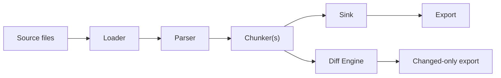

# Getting Started

This guide walks you through installing docprep and running your first document ingestion.

## Prerequisites

- Python 3.10 or later
- pip (or any PEP 517-compatible installer)

## Installation

```bash
pip install docprep
```

For PostgreSQL support:

```bash
pip install docprep[postgres]
```

## How docprep works

docprep is a document ingestion layer for RAG pipelines. It transforms source documents into structured chunks through a deterministic pipeline:



1. **Loader** discovers and reads source files (Markdown by default; configure `loader.type = "filesystem"` and `parser.type = "auto"` for HTML, RST, plain text)
2. **Parser** extracts structure: headings, frontmatter, body content
3. **Chunker(s)** split documents into heading-based sections, then into sized chunks
4. **Sink** (optional) persists results to a database (SQLAlchemy) for incremental sync
5. **Export** produces JSONL records ([VectorRecordV1](export.md)) for loading into any vector store

Every chunk gets a deterministic ID based on its content and position. When documents change, docprep computes a structural diff and exports only what changed.

## Quick start with config file

Create a `docprep.toml` in your project root:

```toml
source = "docs/"

[sink]
database_url = "sqlite:///docs.db"
create_tables = true

[[chunkers]]
type = "heading"

[[chunkers]]
type = "token"
max_tokens = 512
```

Then run:

```bash
# Ingest documents into the database
docprep ingest

# Preview document structure without persisting
docprep preview

# Export as JSONL
docprep export -o records.jsonl

# Show what changed since last ingest
docprep diff
```

## Quick start with Python API

```python
from docprep import ingest

result = ingest("docs/")
for doc in result.documents:
    print(f"{doc.title}: {len(doc.sections)} sections, {len(doc.chunks)} chunks")
```

### With database persistence

```python
from sqlalchemy import create_engine
from docprep import ingest
from docprep.sinks.sqlalchemy import SQLAlchemySink

engine = create_engine("sqlite:///docs.db")
sink = SQLAlchemySink(engine=engine)

result = ingest("docs/", sink=sink)
print(f"Persisted: {result.persisted}, Skipped: {len(result.skipped_source_uris)}")
```

### Streaming JSONL export

```python
from docprep import ingest
from docprep.export import iter_vector_records_v1, write_jsonl

result = ingest("docs/")

with open("records.jsonl", "w") as f:
    count = write_jsonl(iter_vector_records_v1(result.documents), f)
    print(f"Exported {count} records")
```

## Next steps

- [Configuration Reference](configuration.md) — full `docprep.toml` reference
- [CLI Reference](cli-reference.md) — all commands and options
- [Python API](python-api.md) — programmatic usage
- [Export and Vector Records](export.md) — JSONL export and VectorRecordV1 schema
- [Plugins](plugins.md) — extend docprep with custom loaders, parsers, and chunkers
- [Adapters](adapters.md) — integrate external converters (MarkItDown, Docling, etc.)
- [Architecture](architecture.md) — design overview and module structure
